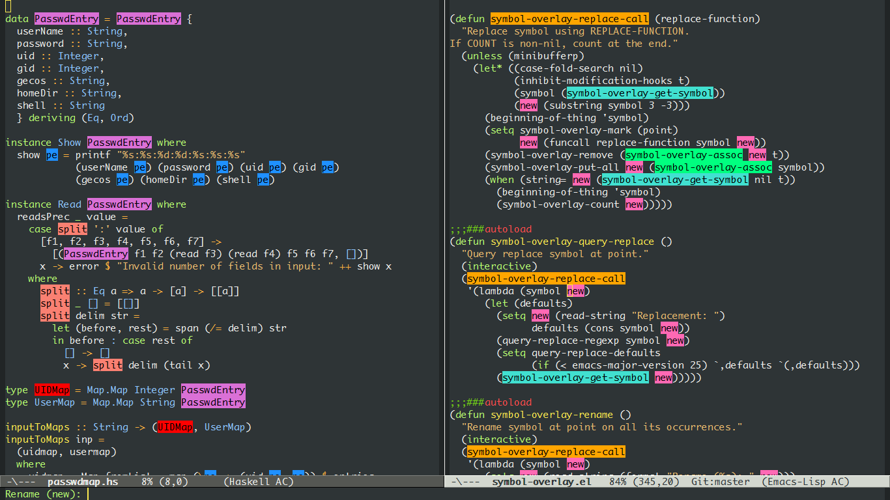

# Symbol Overlay

  

Highlight symbols with overlays while providing a keymap for various operations about highlighted symbols.  It was originally inspired by the package `highlight-symbol`.  The fundamental difference is that in `symbol-overlay` every symbol is highlighted by the Emacs built-in function `overlay-put` rather than the `font-lock` mechanism used in `highlight-symbol`.

What's New!
---

### 20190306:

New commands `symbol-overlay-jump-first` (key "<") and `symbol-overlay-jump-last` (key ">") are now enabled.

### 20190305:

New customizable variable `symbol-overlay-displayed-window` is introduced to control the overlay behavior at `symbol-overlay-mode`. If it is non-nil, occurrences outside the displayed window will not be counted or highlighted.

### 20170826:

`symbol-overlay-toggle-in-scope` now affects both global and in-scope highlighting. `symbol-overlay-rename` now uses the original symbol name as the initial text in minibuffer. New command `symbol-overlay-count` for counting symbol at point. And other improvements.

### 20170426:

Minor-mode `symbol-overlay-mode` for auto-highlighting is now enabled.

### 20170423:

Toggling to isearch-mode is now enabled. Try `symbol-overlay-isearch-literally` via "s" to search the not-quoted symbol in isearch-mode.

### 20170420:

Toggling overlays to be showed in buffer or only in scope is now enabled.  When symbol is highlighted in scope, all related operations is narrowed to the scope, too. Try `symbol-overlay-toggle-in-scope` via "t".  This feature is applicable only for languages that support the lisp function `narrow-to-defun`. Otherwise you may specify `beginning-of-defun-function` and `end-of-defun-function` on your own.

### 20170417:

Auto-refresh is now enabled. Every time the highlighted text is changed or a new occurrence shows up, the buffer will refresh automatically.

Two new commands added: `symbol-overlay-save-symbol` for copying the current symbol, `symbol-overlay-echo-mark` for undoing a recent jump.

Advantages
---

### Fast

When highlighting symbols in a buffer of regular size and language, `overlay-put` behaves as fast as the traditional Highlighting method `font-lock`.  However, for a buffer of major-mode with complicated keywords syntax, like haskell-mode, `font-lock` is quite slow even the buffer is less than 100 lines.  Besides, when counting the number of highlighted occurrences, `highlight-symbol` will call the function `how-many` twice, which could also result in an unpleasant delay in a large buffer.  Those problems don't exist in `symbol-overlay`.

### Convenient

When putting overlays on symbols, **an auto-activated overlay-inside keymap** will enable you to call various useful commands with **a single keystroke**.

### Powerful

- Toggle all overlays of symbol at point: `symbol-overlay-put`
- Jump between locations of symbol at point: `symbol-overlay-jump-next` & `symbol-overlay-jump-prev`
- Switch to the closest symbol highlighted nearby: `symbol-overlay-switch-forward` & `symbol-overlay-switch-backward`
- Minor mode for auto-highlighting symbol at point: `symbol-overlay-mode`
- Remove all highlighted symbols in the buffer: `symbol-overlay-remove-all`
- Copy symbol at point: `symbol-overlay-save-symbol`
- Toggle overlays to be showed in buffer or only in scope: `symbol-overlay-toggle-in-scope`
- Jump back to the position before a recent jump: `symbol-overlay-echo-mark`
- Jump to the definition of symbol at point: `symbol-overlay-jump-to-definition`
- Isearch symbol at point literally, without `regexp-quote` the symbol: `symbol-overlay-isearch-literally`
- Query replace symbol at point: `symbol-overlay-query-replace`
- Rename symbol at point on all its occurrences: `symbol-overlay-rename`

Usage
---

To use `symbol-overlay` in your Emacs, you need only to bind these keys:

    (require 'symbol-overlay)
	(global-set-key (kbd "M-i") 'symbol-overlay-put)
	(global-set-key (kbd "M-n") 'symbol-overlay-switch-forward)
	(global-set-key (kbd "M-p") 'symbol-overlay-switch-backward)
	(global-set-key (kbd "<f7>") 'symbol-overlay-mode)
	(global-set-key (kbd "<f8>") 'symbol-overlay-remove-all)

Default key-bindings defined in `symbol-overlay-map`:

    "i" -> symbol-overlay-put
	"n" -> symbol-overlay-jump-next
	"p" -> symbol-overlay-jump-prev
    "w" -> symbol-overlay-save-symbol
	"t" -> symbol-overlay-toggle-in-scope
    "e" -> symbol-overlay-echo-mark
	"d" -> symbol-overlay-jump-to-definition
	"s" -> symbol-overlay-isearch-literally
	"q" -> symbol-overlay-query-replace
	"r" -> symbol-overlay-rename

You can re-bind the commands to any keys you prefer by simply writing

    (define-key symbol-overlay-map (kbd "your-prefer-key") 'any-command)

Or you may prefer to overwrite the keymap

    (let ((map (make-sparse-keymap)))
      (define-key map (kbd "key1") 'command-1)
      (define-key map (kbd "key2") 'command-2)
      (setq symbol-overlay-map map))
 
As a final example, you can define a handy set of keys using `transient`:
see the snippet posted [here](https://github.com/wolray/symbol-overlay/issues/59).
